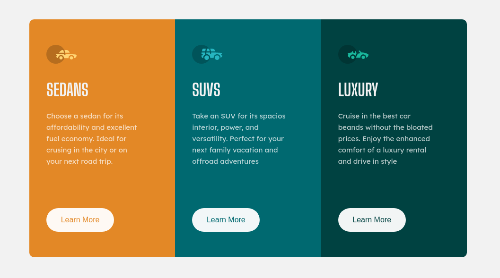

# Frontend Mentor - 3-column preview card component solution

This is a solution to the [3-column preview card component challenge on Frontend Mentor](https://www.frontendmentor.io/challenges/3column-preview-card-component-pH92eAR2-). Frontend Mentor challenges help you improve your coding skills by building realistic projects. 

## Table of contents

- [Overview](#overview)
  - [The challenge](#the-challenge)
  - [Screenshot](#screenshot)
  - [Links](#links)
- [My process](#my-process)
  - [Built with](#built-with)
  - [What I learned](#what-i-learned)
  - [Continued development](#continued-development)
  - [Useful resources](#useful-resources)
- [Author](#author)
- [Acknowledgments](#acknowledgments)

**Note: Delete this note and update the table of contents based on what sections you keep.**

## Overview

### The challenge

Users should be able to:

- View the optimal layout depending on their device's screen size
- See hover states for interactive elements

### Screenshot

### Links

- Solution URL: [Add solution URL here](https://your-solution-url.com)
- Live Site URL: [Add live site URL here](https://your-live-site-url.com)

## My process

Tried to build mobile first which was easy, but I wanted to be precise and use a minimal amount of media queries. So I built the mobile version intially using block, but as i played with the expanding view port 
I noticed some inconsistencies, and I felt more comfortable designing the desktop with flex then working down to the mobile.

## What I learned

I didn't want to use a set color for the button fonts, which I noticed was the same color as the container background. If the background color were to change I wanted the
text color of the button to match it without the extra markup. So I wanted to make the text transparent and shine through the button background to show the container 
looking background.

### Built with

- Semantic HTML5 markup
- CSS custom properties
- Flexbox

### Continued development

-Delve deeper into flexbox
-Explore mix blend modes

